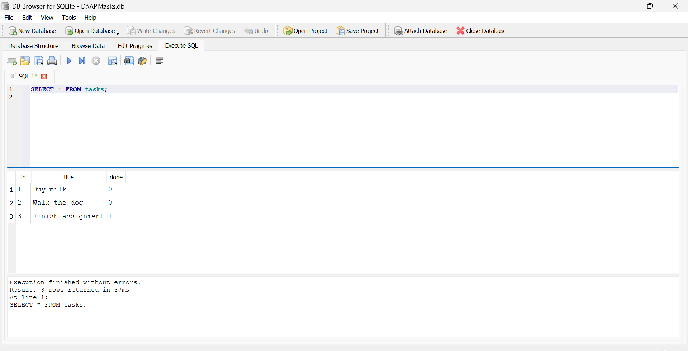
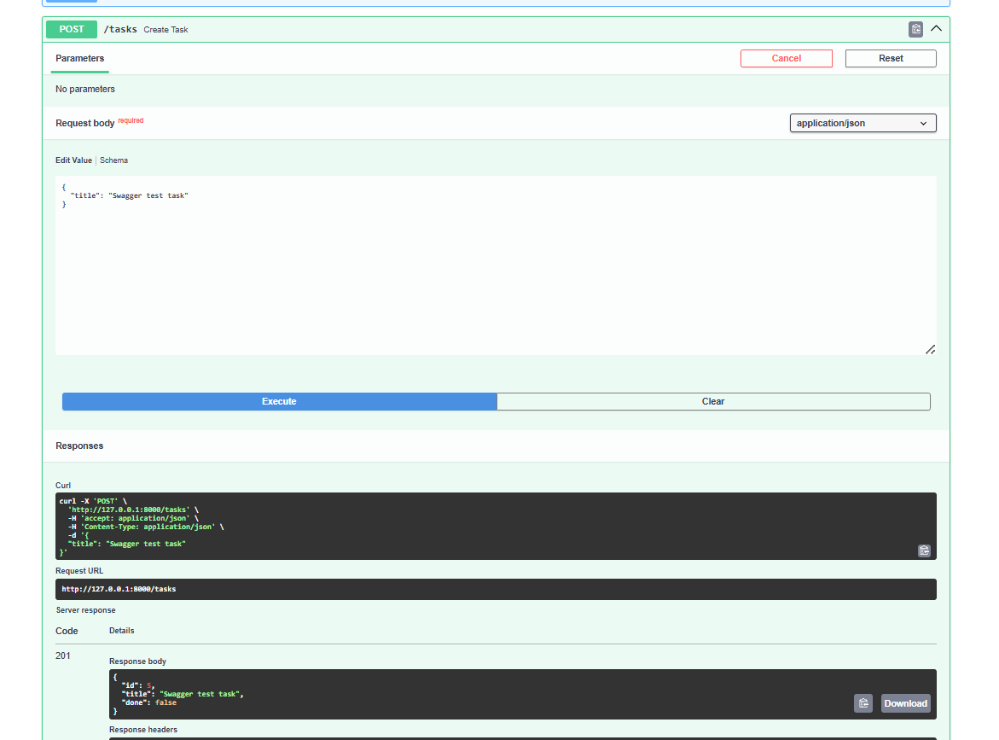

# Task API

A small CRUD (Create, Read, Update, Delete) API for managing a to-do list, built with FastAPI. Tasks are now stored in a real SQLite database (`tasks.db`), so your data survives a server restart. Fully documented and testable through Swagger UI.

## How to run it

1. Install dependencies:
   ```
   pip install fastapi uvicorn
   ```

2. Start the server:
   ```
   python -m uvicorn main:app --reload
   ```

3. The API is now running at `http://127.0.0.1:8000`

4. Interactive docs (Swagger UI) are available at `http://127.0.0.1:8000/docs`

5. On first run, `tasks.db` is created automatically in the project folder, with a `tasks` table seeded with 3 example tasks. Restarting the server does not duplicate the seed data or wipe it.

## Why SQLite

SQLite is a single-file database with no separate server to install or run. For a project this size, it's the simplest way to get real persistence (data that survives a restart) without the overhead of setting up Postgres or MySQL. The whole database is just the file `tasks.db`, created automatically the first time the app runs.

## Where the database lives

The database file `tasks.db` sits in the project's root folder, next to `main.py`. It's excluded from Git (see `.gitignore`), so each fresh clone of this repo starts with its own empty database, auto-created and auto-seeded on first run.

## Endpoints

| Method | Path | Description |
|--------|------|-------------|
| GET | `/` | API info (name, version, endpoints) |
| GET | `/health` | Health check — confirms the server is alive |
| GET | `/tasks` | List all tasks |
| GET | `/tasks/{task_id}` | Get a single task by id |
| POST | `/tasks` | Create a new task |
| PUT | `/tasks/{task_id}` | Update an existing task's title and/or done status |
| DELETE | `/tasks/{task_id}` | Delete a task |

## Status codes

| Code | Meaning | When it happens |
|------|---------|------------------|
| 200 | OK | Successful read or update |
| 201 | Created | Task successfully created |
| 204 | No Content | Task successfully deleted |
| 400 | Bad Request | Missing or empty `title` on create/update |
| 404 | Not Found | No task exists with the given id |

## Example request

```
curl -i -X POST http://127.0.0.1:8000/tasks -H "Content-Type: application/json" -d '{"title": "Test task"}'
```

Response:
```
HTTP/1.1 201 Created
content-type: application/json

{"id":4,"title":"Test task","done":false}
```

## Exploring the database directly

You can open `tasks.db` in [DB Browser for SQLite](https://sqlitebrowser.org/) to see the raw table and run SQL by hand. Example query run during development:

```sql
SELECT * FROM tasks;
```

This returned all 3 seeded tasks, matching exactly what `GET /tasks` returns through the API — proving the API and the database file are the same source of truth, no syncing involved.



One real thing worth noting: after running an `UPDATE` or `DELETE` query inside DB Browser, the change doesn't touch the actual `tasks.db` file until you click "Write Changes" in the toolbar. Until then, the API (a separate process reading the same file) won't see the update.

## Swagger UI

Every endpoint is listed and testable via "Try it out" at `/docs`.



## Note on persistence

Unlike the earlier in-memory version, tasks now survive a server restart, since they live in `tasks.db` on disk instead of a Python list in memory. The database file and table are created automatically if missing, and the 3 example tasks are only seeded the first time (checked by counting existing rows before inserting).

## Stage 7 — AI vs me

I gave an AI the following prompt and compared its generated API against my own hand-built version.

**Prompt used:**

> Build a REST API for managing a to-do list using Python and FastAPI. It needs these endpoints:
>
> - `GET /` — returns basic API info: name, version, and a list of available endpoints
> - `GET /health` — returns a simple status check, e.g. `{"status": "ok"}`
> - `GET /tasks` — returns the full list of tasks
> - `GET /tasks/{id}` — returns a single task matching that id; if no task has that id, return status 404 with a JSON error message
> - `POST /tasks` — creates a new task from a JSON body containing a `title`; validates that `title` is present and non-empty, returning status 400 if it's missing; on success, assigns the next available id, sets `done` to false, and returns status 201 with the created task
> - `PUT /tasks/{id}` — updates an existing task's `title` and/or `done` fields from the JSON body; returns the updated task, or 404 if the id doesn't exist
> - `DELETE /tasks/{id}` — removes the task with that id, returning status 204 with no body; returns 404 if the id doesn't exist
>
> Data should be stored in memory only (a Python list), with no database — data resets when the server restarts. It should also include Swagger UI (FastAPI provides this automatically at `/docs`) so I can test all endpoints interactively without curl.

**What the AI did better:** its validation used `.strip()` before checking if the title was empty, so a whitespace-only title (`"   "`) correctly gets rejected with 400. My own validation (`if not title`) doesn't catch this — I tested both side by side with the same request and my version incorrectly accepted a whitespace-only title as valid (201 Created), while the AI's correctly returned 400.

**What it got wrong or silently decided:** it started with an empty task list instead of pre-filled example tasks, and it used a running id counter instead of `max(existing ids) + 1` — meaning ids are never reused after a delete, unlike mine. Neither of these was specified in my prompt, so the AI just made a reasonable choice on its own.

**What my prompt forgot to specify:** I never mentioned seed/example data, or what should happen to task ids after a delete. Both silent decisions turned out reasonable, but it showed me my specification wasn't as complete as I thought it was.
